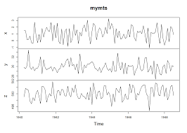

# Introduction

## What is time series data ?
   Time series data is data that is collected at different points of time unlike normal data that we find in most of the datasets which is measured at a single point of time ; time series data is collected at adjacent time periods and thus there is a possibility of correlation between the observations.This adds another dimensionality to data a <b>Time</b> dimension.This is one of the special features that distinguises time series data from normal data .Time series data is normally recorded at regular intervals(eg Hourly,Monthly ,Weekly etc) and this is the most common case known as  <b>Regular Time Series</b>.However this is not true all the time and sometimes time series data is recorded at irregular intervals and this is called <b>Irregular Time Series</b> we'll focus on regular time series for now.

   

   This is a plot of a stock price with X axis denoting the number of months and Y axis the price .

## Univariate Vs Multivariate Time Series 
  Time series in which one variable varies with time is called <b>Univariate</b> Time series data and the if multiple variables vary with time it is called <b>Multivariate</b> time series data . In the plot above we have univariate time series data . 

   

  The above plot represents Multivariate time series data;
  but there is a lot of difficulty to visualize data in such a manner thus we plot different graphs for each variable as u see in the image below

   

  

   
