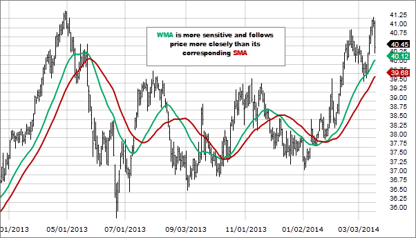
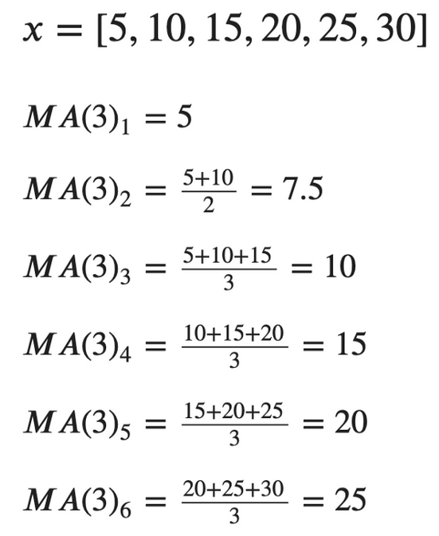
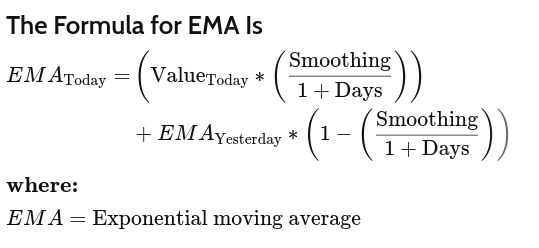
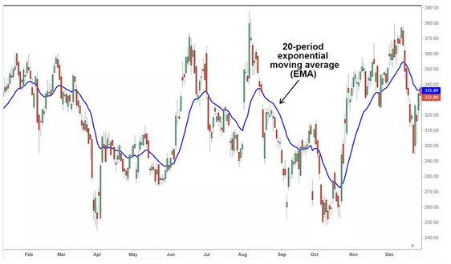

# Moving Average (MA)

- When data is missing in a time series, we can use some form of imputation or interpolation to impute a missing value. 

- We can also use it to filter out the noise from random movements in the data and smooth it out in order to see the average value.

- Moving averages are used to identify trends. This method is based on previous collected data therefore, it can be called as a lagging indicator, meaning it can confirm when a trend change has taken place but it will not warn you in advance. 

- There are three main types of Moving Averages:
  - Simple Moving Average (SMA)
  - Weighted Moving Average (WMA)
  - Exponential Moving Average (EMA)

---

# Simple Moving Average (SMA) 

- Simple Moving Average is a method of time series smoothing and is actually a very basic forecasting 
technique.
- A simple moving average (SMA) calculates the average of a selected range of prices, usually closing prices, by the number of periods in that range. 
- It does not need estimation of parameters, but rather is based on order selection.
- It assigns equal weighting to all values
- Moving averages alone aren’t that useful for forecasting. Instead, they are mainly used for analysis. 
- For example, moving averages help stock investors in technical analysis by smoothing out the volatility of constantly changing prices. This way, short-term fluctuations are reduced, and investors can get a more 
generalized picture. 

---

- Math-wise, simple moving averages are dead simple to implement

For example, 

- We take a dataset of Airline passengers over a period of time which looks like this: 

- Applying SMA, on existing dataset we notice that for different values of MA we get slightly different graphs.

## Downside

- As equal weight is given to all periods considered in the calculation the simple moving average is slower to respond to rapid data changes that might prove to be important.
- We use Weighted or Exponential Moving Average to counter this
- They are more preferable because they give more weights to recent data. This also allows us to recover existing trends successfully.

---

# Exponential Moving Average (EMA)

- An exponential moving average (EMA) is a type of moving average (MA) that places a greater weight and significance on the most recent data points. The exponential moving average is also referred to as the exponentially weighted moving average. An exponentially weighted moving average reacts more significantly to recent price changes than a simple moving average (SMA), which applies an equal weight to all observations in the period. 

- That gives the most recent observation more weight. If the smoothing factor is increased, more recent observations have more influence on the EMA. 

- The biggest advantage of EMA is that it keeps the trends intact compared to SMA which smoothens all the edges out. 

- The major difference between an EMA and an SMA is the sensitivity each one shows to changes in the data used in its calculation. 

